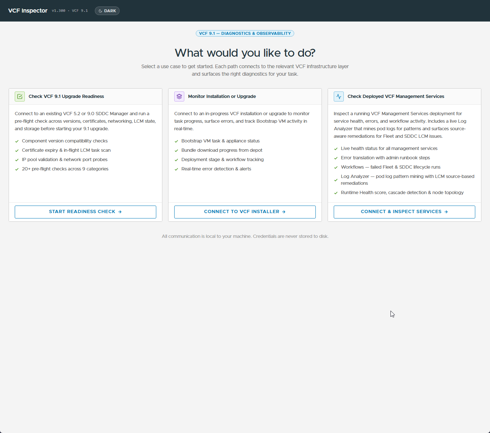
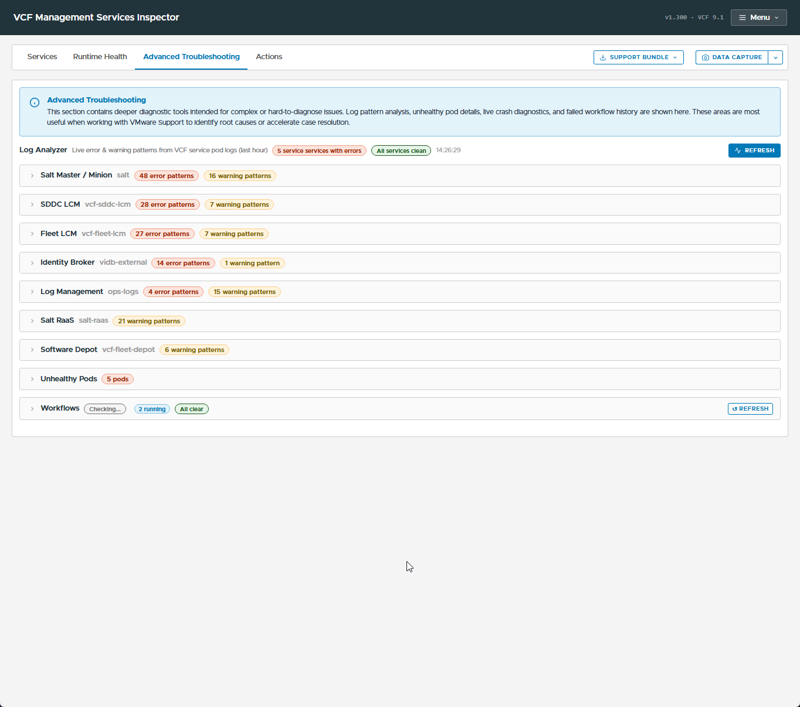
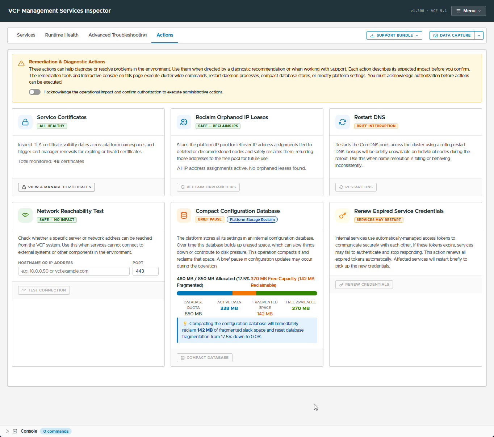

# VCF Inspector Fling: fleet-level pre-upgrade and health diagnostics

**VCF only.** Every mode connects to either SDDC Manager or a VCF
Services Runtime control-plane VM – layers that only exist in a fleet
driven through VCF Management Services. A standalone VVF or plain
vSphere environment has nothing for it to point at.

A standalone, no-install binary that runs on an admin workstation or
jumpbox, rather than a vCenter/PSC-level tool like [VDT and
lsdoctor](17-vdt-and-lsdoctor-diagnostics.md) – VCF Inspector operates at
the fleet layer instead, which is exactly the layer where the patching
failures documented in [Patching an existing VCF 9.1
fleet](20-patching-an-existing-vcf9-fleet.md) happen (stuck lifecycle
tasks, components silently deadlocked behind an apparent "Healthy"
status). Launching the binary opens a **local web UI in the browser**
(light/dark theme toggle in the header) rather than a terminal TUI – per
its own landing screen: *"All communication is local to your machine.
Credentials are never stored to disk."*

**Field-observed (v1.300, own lab environment) – the landing screen
presents three use-case cards, each connecting to a different VCF
infrastructure layer:**



- **Check VCF 9.1 Upgrade Readiness** – connects to an **existing VCF
  5.2 or 9.0 SDDC Manager** and runs a pre-flight check before starting a
  9.1 upgrade: component version compatibility, certificate expiry and
  in-flight LCM task scan, IP pool validation and network port probes –
  **20+ pre-flight checks across 9 categories**. This targets the same
  moment as the prerequisites tables in [Full VCF upgrade
  sequence](13-vcf-upgrade-sequence.md) – a source on 5.2 or 9.0.x
  heading to 9.1, not a 9.1.0.x → 9.1.1 patch – run it as a second,
  independent confirmation, not a replacement.
- **Monitor Installation or Upgrade** – connects to an **in-progress VCF
  installation or upgrade** (button: *Connect to VCF Installer*) to track
  Bootstrap VM task and appliance status, bundle download progress from
  the depot, deployment stage/workflow tracking, and real-time error
  detection and alerts.
- **Check Deployed VCF Management Services** – inspects an **already
  running** VCF Management Services deployment: live health status for
  every management service, error translation with admin runbook steps,
  workflows for failed Fleet/SDDC lifecycle runs, a **Runtime Health
  score with cascade detection and node topology**, and a **live Log
  Analyzer** that mines pod logs for patterns and surfaces source-aware
  remediations for Fleet and SDDC LCM issues – not mentioned in the
  official announcement blog at all. This is the capability most
  relevant to the [Upgrade All failure
  account](20-patching-an-existing-vcf9-fleet.md#step-2-respect-the-mandatory-dependency-order)
  – a 13-day silent deadlock that the fleet's own UI reported as
  "Healthy" the whole time. A tool built for cascade detection and live
  log pattern mining is the kind of second opinion that account's
  after-the-fact recovery would have benefited from.

**This is a VMware Fling, not officially supported production
software.** Treat it as a diagnostic aid, not a gate the patch process
depends on, and expect rough edges – feedback goes back through the
Flings community channel it ships with. That caveat carries more weight
than it would for a purely read-only tool: the Management Services
Inspector's **Actions tab** (below) executes real cluster-wide
remediation – DNS restarts, credential renewal, database compaction –
against the live environment, not just diagnostics.

## Download and setup

Download the platform-matching binary from the Broadcom Support Portal
Free Downloads / Flings section (search for **VCF Inspector**) – no
installer, no appliance to deploy:

| Platform | Binary |
| --- | --- |
| macOS (Apple Silicon) | `vcf-inspector-darwin-arm64-native` |
| Linux (x86_64) | `vcf-inspector-linux-amd64` |
| Windows (x86_64) | `vcf-inspector-windows-amd64-native.exe` |

**macOS/Linux:**
```
chmod +x ./vcf-inspector-darwin-arm64-native
./vcf-inspector-darwin-arm64-native
```

**Windows:** double-click the `.exe`.

**Each of the three modes connects to a different target with different
credentials – there's no single generic login.** Field-observed (v1.300):

- **Check VCF 9.1 Upgrade Readiness** connects to **SDDC Manager**.
  Select the **current VCF version first** (a toggle: **VCF 5.2.x** or
  **VCF 9.0.x** – no 9.1 option, since this mode is specifically for a
  pre-9.1 source assessing readiness to move to 9.1), then supply the
  SDDC Manager IP/hostname (port suffix supported for non-standard
  ports, e.g. `10.0.0.1:9004`) and an SSO admin login (placeholder
  `administrator@vsphere.local`). Button: **Connect & Run Pre-Flight
  Check**.
- **Monitor Installation or Upgrade** also connects to **SDDC Manager**
  (IP/FQDN, `admin` + the SDDC Manager password) – but unlike the other
  two modes, it needs **no separate Bootstrap VM credentials**: *"The
  Bootstrap VM is auto-discovered via SDDC Manager."* Button: **Connect &
  Monitor**.
- **Check Deployed VCF Management Services** connects somewhere entirely
  different: **SSH directly to a VCF Services Runtime control plane VM**
  (not SDDC Manager), default username `vmware-system-user`, with an
  **Advanced Connection Options** section for a non-default SSH port and
  an optional pasted SSH private key (PEM) in place of a password. It
  also surfaces a callout pointing at **VCF Operations' own Health
  Dashboard** as a suggested first check before connecting here at all.
  Button: **Connect & Inspect**.

All three forms offer a **Save connection** option, and a prior session's
saved connections reappear as chips on return visits (e.g. a saved IP) –
so despite the tool's own framing, *some* connection state does persist
between runs.

**Credential-storage claims are inconsistent across screens, and that
matters before pointing this at anything sensitive.** The landing page's
blanket claim is *"Credentials are never stored to disk."* The Management
Services Inspector screen's own footer instead says *"Credentials are
stored in browser local storage only"* – a materially different claim
(browser local storage is disk-backed, just sandboxed to the app's
origin) that directly contradicts the landing page one screen up.
Unresolved as of v1.300 – until VMware clarifies which is accurate,
treat any saved connection/credential as retained somewhere on the
machine running the tool, and don't save credentials for a production
control-plane node on a shared workstation.

**Supported source versions:** the announcement blog describes the tool
as built for VCF 9.1, but the readiness-check mode's own version toggle
(v1.300) only offers **VCF 5.2.x or VCF 9.0.x** as the *source* being
assessed – i.e. this mode is for a pre-9.1 fleet checking readiness to
reach 9.1, not for validating a fleet already on 9.1. The other two
modes (Deployment Monitor, Management Services Inspector) do target VCF
9.1 itself, per their header badges (`VCF 9.1`). Confirm which mode
matches the source version actually in play before relying on it.

---

## Field-observed: Management Services Inspector walkthrough (lab environment)

Once connected, the header's **Use Cases** link becomes a **Menu**
dropdown, and four tabs appear alongside always-present **Support
Bundle** and **Data Capture** buttons: **Services**, **Runtime Health**
(not captured here), **Advanced Troubleshooting**, and **Actions**.

**A recurring UI pattern across all three tabs: multiple status chips
appear side by side rather than one resolved verdict** – e.g. Backup
shows `Checking...` / `OK` / `Not Configured` together, Database Cluster
Health shows `3 clusters healthy` *and* `No clusters found` together,
Workflows shows `Checking...` / `2 running` / `All clear` together. Read
the detail panel or the underlying number, not just the badge set, before
concluding a section is fine or broken.

### Services tab

- **Top-line summary:** Total Services / Online / Degraded / Critical
  counts (observed: 8 / 8 / 0 / 0).
- **Platform IP Pool:** allocation bar (total/assigned/orphaned/free),
  a sizing callout confirming the pool meets VCF Services Runtime's
  **12–30 IP** requirement and how many more scale-out nodes the free
  balance supports (2 IPs per node for Node IP + Pod CIDR), and an
  expandable **exact navigation path to expand it** – this corroborates
  and extends the UI path documented in [Patching an existing VCF 9.1
  fleet, Step 3](20-patching-an-existing-vcf9-fleet.md#step-3-the-ui-walkthrough-per-component):
  log into VCF Operations as **Administrator**, **Build → Lifecycle →
  VCF Management**, select **VCF Services Runtime**, actions menu →
  **Expand Node IP Pool**.
- **Virtual IPs table:** Control Plane VIP, VCF Services Runtime FQDN,
  Fleet Components FQDN, Instance Components FQDN, VIDB FQDN, and Log
  Management FQDN, each with its own IP – confirms these are distinct
  addressable endpoints, not aliases of one shared VIP.
- **Node IP Assignments table:** every node's name, role (Control
  Plane / Worker Node), and IP.
- **Deployed Services (8 cards observed):** grouped by category –
  **Lifecycle Management** (SDDC Lifecycle Manager, Fleet Lifecycle
  Manager, Software Depot), **VCF Salt Services**, **Identity**
  (Identity Broker), **Telemetry**, **Realtime Metrics**, **Logging**
  (Log Management) – each card shows an internal short name (`SDDC LCM`,
  `Fleet LCM`, `vidb-external`, `Telemetry Acceptor`, `Ops for Logs
  (mops)`, etc.), a one-line description, and an Online/Degraded/Critical
  badge. **VCF Automation and the Migration Service Engine did not
  appear** in this lab's 8-service list – consistent with VCF Automation
  running its own separate deployment rather than being one of the 8
  fleet-wide VCF Services Runtime services (though a field-verified fact
  from the sister repo confirms Automation's *lifecycle operations* do
  authenticate against this same fleet-wide runtime, not a separate
  Automation-specific one). This is also the highest-risk, most complex
  pair in [docs/20's patching
  order](20-patching-an-existing-vcf9-fleet.md#step-2-respect-the-mandatory-dependency-order),
  which moves both to the end for that reason. **Open question, untested
  ([issue #27](https://github.com/pauldiee/VCFUpgradeGuide/issues/27)):**
  whether pointing this same connect form at a VCF Automation
  control-plane node (rather than the VCF Services Runtime one) would
  also work – the form only asks for a generic control-plane IP and SSH
  credentials, but the Services tab and Log Analyzer only surfaced the 8
  fleet-wide services here, so it's unconfirmed whether Automation's own
  components would even be recognized.
- **Control Plane Nodes:** per-node CPU/memory gauges and a **System
  Services** list flagging any service in a bad state – field-observed
  5 flagged services on one node: `kube-controller-manager`,
  `kube-scheduler`, `kube-vip-<node>`, `vsphere-cpi`,
  `vsphere-csi-controller` (all tagged `sys`).
- **VCF Management Services Backup – directly relevant to patching.**
  Fields: SFTP Storage Target, Last Backup Timestamp, Status. Field
  observed **"No backup found"** with an explicit warning: *"Automated
  backups for VCF Management Services are either not configured or the
  last backup attempt failed or is older than 24 hours. Ensure SFTP
  automated backups are configured prior to executing updates or
  configuration changes."* This is the same automatic pre-patch backup
  mechanism documented in [Patching an existing VCF 9.1 fleet, Backup
  before patching](20-patching-an-existing-vcf9-fleet.md#backup-before-patching-and-what-rollback-actually-means)
  – checking this panel before opening a patch window is a faster
  confirmation than digging through **Build → Lifecycle → VCF Management
  → Backup & Restore** by hand.
- **NTP Synchronisation:** per-node offset table. **Field-observed
  anomaly:** every node showed an offset of **~0.0ms** yet was still
  badged **"Not Synced"** – don't treat the badge alone as a live drift
  alarm; check the offset value first.
- **Other panels observed, collapsed by default:** Volumes/Disks (PVC
  bound count), VCF Services Runtime Tasks (active task count), Node
  Placement (spread/zone status), Database Cluster Health, Platform
  Package Status (packages ready count), Platform Engine & Core
  Stability (probe count).

### Advanced Troubleshooting tab

Framed in its own intro callout as *"deeper diagnostic tools... most
useful when working with VMware Support to identify root causes or
accelerate case resolution"* – i.e. escalation-tier detail, not the
first place to look.



- **Log Analyzer** – *"Live error & warning patterns from VCF service
  pod logs (last hour)"*, refreshable, broken down per service with its
  internal short name and separate error/warning pattern counts.
  Field-observed counts (a snapshot, not necessarily representative):
  Salt Master/Minion 48 errors / 16 warnings, SDDC LCM 28/7, Fleet LCM
  27/7, Identity Broker 14/1, Log Management 4/15, Salt RaaS 0/21,
  Software Depot 0/6. High counts here don't necessarily mean the
  service is unhealthy on their own – cross-check against the Services
  tab's Online/Degraded/Critical badge for that same service before
  treating a pattern count as an active problem.
- **Unhealthy Pods** – a count with drill-down (field-observed: 5 pods).
- **Workflows** – failed/running Fleet and SDDC lifecycle workflow
  history, refreshable.

### Actions tab

**This tab executes real remediation against the live environment, not
just diagnostics** – closer to lsdoctor's repair modes than to VDT's
read-only sweep, and gated behind an explicit consent toggle: *"I
acknowledge the operational impact and confirm authorization to execute
administrative actions."* Per its own warning banner: *"The remediation
tools and interactive console on this page execute cluster-wide
commands, restart daemon processes, compact database stores, or modify
platform settings."* Six actions observed, each carrying its own impact
badge:



| Action | Impact badge | What it does |
| --- | --- | --- |
| Service Certificates | All healthy | Inspects TLS cert validity across platform namespaces and can trigger cert-manager renewals for expiring/invalid certs (48 certificates monitored in this lab) |
| Reclaim Orphaned IP Leases | Safe – reclaims IPs | Scans the platform IP pool for leases tied to deleted/decommissioned nodes and reclaims them |
| Restart DNS | Brief interruption | Rolling restart of CoreDNS pods cluster-wide; per-node DNS lookups briefly unavailable during rollout |
| Network Reachability Test | Safe – no impact | Tests whether a given hostname/IP:port is reachable from the VCF system |
| Compact Configuration Database | Brief pause (platform storage reclaim) | Compacts the internal config database and reclaims fragmented space; a brief pause in config updates may occur |
| Renew Expired Service Credentials | Services may restart | Renews expired inter-service auth tokens; affected services restart briefly to pick up new credentials |

The Compact Configuration Database panel also surfaces live capacity
numbers (quota, active data, fragmented space, free available, percent
fragmented) before you commit to running it – worth checking that number
before assuming it needs to run. A collapsed **Console** panel sits below
the action cards (`0 commands` in this lab) – an interactive command
console, not explored further here.

---

## Sources

- [VCF Inspector Fling (official VMware Cloud Foundation blog)](https://blogs.vmware.com/cloud-foundation/2026/07/28/vcf-inspector-fling/) – announcement, capabilities, download location, and usage
