# VCF Inspector Fling: fleet-level pre-upgrade and health diagnostics

**VCF only.** Every mode connects to either SDDC Manager or a VCF
Services Runtime control-plane VM – layers that only exist in a fleet
driven through VCF Management Services. A standalone VVF or plain
vSphere environment has nothing for it to point at. **One possible
exception since v1.427:** the readiness check now also connects
*"directly to vCenter Server"*, per its own landing card, and a lab run
against a vCenter 9.0.2 completed (see [the readiness run
below](#field-observed-upgrade-readiness-run-against-a-vcenter-server-lab-environment)).
Until that has been run against a vCenter in an environment without
SDDC Manager, treat this tool as VCF only.

A standalone, no-install binary that runs on an admin workstation or
jumpbox, rather than a vCenter/PSC-level tool like [VDT and
lsdoctor](17-vdt-and-lsdoctor-diagnostics.md) – VCF Inspector operates at
the fleet layer instead, which is exactly the layer where the patching
failures documented in [Patching an existing VCF 9.1
fleet](20-patching-an-existing-vcf9-fleet.md) happen (stuck lifecycle
tasks, components silently deadlocked behind an apparent "Healthy"
status). Launching the binary opens its **own standalone application
window** with a web-style UI (light/dark theme toggle in the header)
rather than a terminal TUI – **it does not open in the system browser**,
despite the web-app look and its own "browser local storage" wording
(below) suggesting an embedded webview under the hood. Per its own
landing screen: *"All communication is local to your machine.
Credentials are never stored to disk."*

**Field-observed (v1.300 and v1.427, own lab environment) – the landing
screen presents three use-case cards, each connecting to a different VCF
infrastructure layer.** The screenshot is from v1.427:

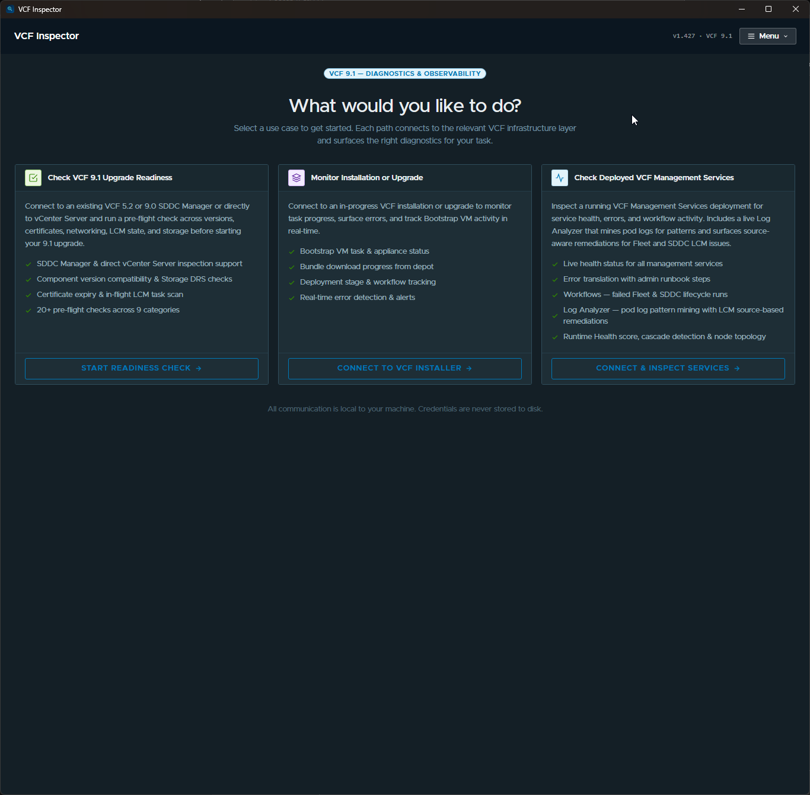

- **Check VCF 9.1 Upgrade Readiness** – connects to an **existing VCF
  5.2 or 9.0 SDDC Manager** and runs a pre-flight check before starting a
  9.1 upgrade: component version compatibility, certificate expiry and
  in-flight LCM task scan, IP pool validation and network port probes –
  **20+ pre-flight checks across 9 categories**. This targets the same
  moment as the prerequisites tables in [Full VCF upgrade
  sequence](13-vcf-upgrade-sequence.md) – a source on 5.2 or 9.0.x
  heading to 9.1, not a 9.1.0.x → 9.1.1 patch – run it as a second,
  independent confirmation, not a replacement. **Changed in v1.427:**
  the card now reads *"Connect to an existing VCF 5.2 or 9.0 SDDC
  Manager or directly to vCenter Server"*, lists *"SDDC Manager & direct
  vCenter Server inspection support"*, and adds **Storage DRS checks**
  next to component version compatibility. The separate line for IP
  pool validation and network port probes is gone from the card; the
  description still names networking as a check area, and the count is
  still 20+ checks across 9 categories.
- **Monitor Installation or Upgrade** – connects to an **in-progress VCF
  installation or upgrade** (button: *Connect to VCF Installer*) to track
  Bootstrap VM task and appliance status, bundle download progress from
  the depot, deployment stage/workflow tracking, and real-time error
  detection and alerts.
- **Check Deployed VCF Management Services** – inspects an **already
  running** VCF Management Services deployment: live health status for
  every management service, error translation with admin runbook steps,
  workflows for failed Fleet/SDDC lifecycle runs, a **Runtime Health
  score with cascade detection and node topology**, and a **live Log
  Analyzer** that mines pod logs for patterns and surfaces source-aware
  remediations for Fleet and SDDC LCM issues – not mentioned in the
  official announcement blog at all. This is the capability most
  relevant to the [Upgrade All failure
  account](20-patching-an-existing-vcf9-fleet.md#step-2-respect-the-mandatory-dependency-order)
  – a 13-day silent deadlock that the fleet's own UI reported as
  "Healthy" the whole time. A tool built for cascade detection and live
  log pattern mining is the kind of second opinion that account's
  after-the-fact recovery would have benefited from.

**This is a VMware Fling, not officially supported production
software.** Treat it as a diagnostic aid, not a gate the patch process
depends on, and expect rough edges – feedback goes back through the
Flings community channel it ships with. That caveat carries more weight
than it would for a purely read-only tool: the Management Services
Inspector's **Actions tab** (below) executes real cluster-wide
remediation – DNS restarts, credential renewal, database compaction,
and since v1.427 a full shutdown of VCF Services Runtime – against the
live environment, not just diagnostics.

## Download and setup

Download the platform-matching binary from the Broadcom Support Portal
Free Downloads / Flings section (search for **VCF Inspector**) – no
installer, no appliance to deploy:

| Platform | Binary | Size (release of 2026-09-29) |
| --- | --- | --- |
| macOS (Intel) | `vcf-inspector-darwin-amd64-native` | 18.14 MB |
| macOS (Apple Silicon) | `vcf-inspector-darwin-arm64-native` | 17.26 MB |
| Linux (x86_64) | `vcf-inspector-linux-amd64` | 15.13 MB |
| Windows (x86_64) | `vcf-inspector-windows-amd64-native.exe` | 19.66 MB |

**macOS/Linux:**
```
chmod +x ./vcf-inspector-darwin-arm64-native
./vcf-inspector-darwin-arm64-native
```

**Windows:** double-click the `.exe`.

**The portal's release number is not the version the tool reports.**
The download page listed this build as **Release 1.400**, dated
2026-09-29, while the running binary shows **v1.427** in its header.
Version numbers in this doc are the ones from the tool's header. To
tell which build you have, start it and read the header; do not go by
the portal's release number.

**Verify the download.** The portal lists a SHA2 (SHA-256) and an MD5
checksum per file. This is Fling software that will be given SSH
access to a control plane node, so compare the hash with the portal's
value before running it:

```
# Windows (PowerShell)
(Get-FileHash -Algorithm SHA256 .\vcf-inspector-windows-amd64-native.exe).Hash.ToLower()

# macOS
shasum -a 256 ./vcf-inspector-darwin-arm64-native

# Linux
sha256sum ./vcf-inspector-linux-amd64
```

**Each of the three modes connects to a different target with different
credentials – there's no single generic login.** Field-observed (v1.300):

- **Check VCF 9.1 Upgrade Readiness** connects to **SDDC Manager**.
  Select the **current VCF version first** (a toggle: **VCF 5.2.x** or
  **VCF 9.0.x** – no 9.1 option, since this mode is specifically for a
  pre-9.1 source assessing readiness to move to 9.1), then supply the
  SDDC Manager IP/hostname (port suffix supported for non-standard
  ports, e.g. `10.0.0.1:9004`) and an SSO admin login (placeholder
  `administrator@vsphere.local`). Button: **Connect & Run Pre-Flight
  Check**.

  **Field-observed (v1.427): the toggle, now labelled *Target System /
  Version*, has a third option, vCenter Server.** Selecting it swaps the
  address field for **vCenter Server IP / Hostname** (*"Enter the FQDN
  or IP of the vCenter Server"*) with the same SSO admin login. The
  form's subtitle still reads *"Connect to SDDC Manager to run pre-flight
  checks for the VCF 9.1 upgrade"*, so the form itself does not say what
  a vCenter target is for. The landing card does: it offers a direct
  vCenter connection as an alternative to SDDC Manager, *"before
  starting your 9.1 upgrade"*.

  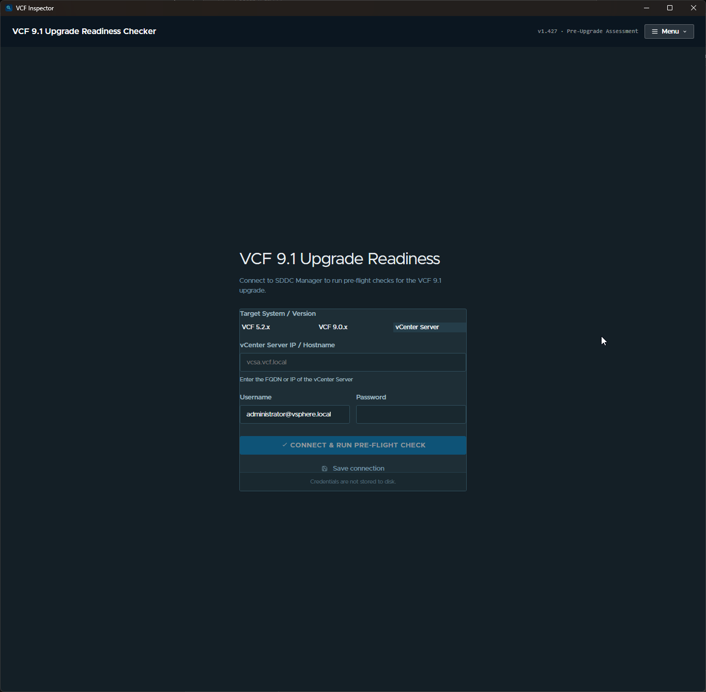

  A run against a vCenter 9.0.2 in the lab worked – see [the readiness
  run below](#field-observed-upgrade-readiness-run-against-a-vcenter-server-lab-environment).
  **Still untested:** whether it works for a vCenter with no SDDC
  Manager anywhere in the environment (standalone VVF or plain
  vSphere), and which other vCenter versions it accepts. The first
  point decides whether this tool becomes useful for the [standalone
  VVF track](14-standalone-vvf-upgrade.md).
- **Monitor Installation or Upgrade** also connects to **SDDC Manager**
  (IP/FQDN, `admin` + the SDDC Manager password) – but unlike the other
  two modes, it needs **no separate Bootstrap VM credentials**: *"The
  Bootstrap VM is auto-discovered via SDDC Manager."* Button: **Connect &
  Monitor**.

  **Field-observed (v1.427): this mode now asks for a scenario first.**
  Two cards, with the note that *"The VCF Services Runtime Bootstrap VM
  will be auto-discovered in both cases"*:

  - **New Installation** – *"Connect to a VCF Installer that is already
    running and performing a new environment deployment."* Button:
    **Connect to VCF Installer**.
  - **Upgrade** – *"Connect to SDDC Manager to monitor an active VCF
    upgrade."* Button: **Connect to SDDC Manager**.

  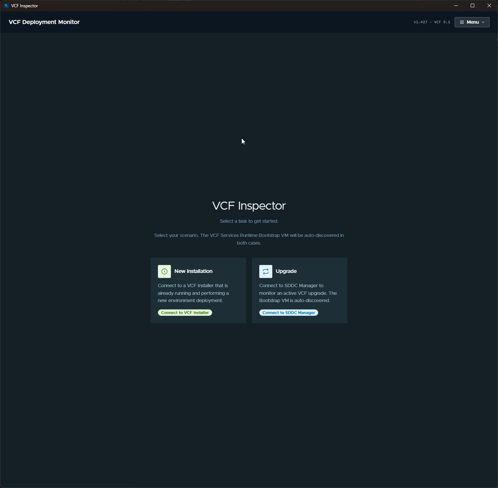

  So the SDDC Manager login described above is the **Upgrade** path; a
  fresh deployment connects to the VCF Installer appliance instead. The
  two forms (v1.427):

  | | New Installation | Upgrade |
  | --- | --- | --- |
  | Form title | Connect to VCF Installer | Connect to SDDC Manager |
  | Address | VCF Installer IP / FQDN, port suffix supported (e.g. `10.0.0.5:9001`) | SDDC Manager IP / FQDN |
  | Username (prefilled) | `admin@local` | `admin` |
  | Password | The OVF deployment password | The SDDC Manager password |
  | Footer | *"Credentials are stored in browser local storage only. Bootstrap VM is auto-discovered – no extra credentials needed."* | *"The Bootstrap VM is auto-discovered via SDDC Manager – no Bootstrap VM credentials needed."* |

  Both have a **Connect & Monitor** button and a **Save connection**
  option.
- **Check Deployed VCF Management Services** connects somewhere entirely
  different: **SSH directly to a VCF Services Runtime control plane VM**
  (not SDDC Manager), default username `vmware-system-user`, with an
  **Advanced Connection Options** section for a non-default SSH port and
  an optional pasted SSH private key (PEM) in place of a password. It
  also surfaces a callout pointing at **VCF Operations' own Health
  Dashboard** as a suggested first check before connecting here at all.
  Button: **Connect & Inspect**.

All three forms offer a **Save connection** option, and a prior session's
saved connections reappear as chips on return visits (e.g. a saved IP) –
so despite the tool's own framing, *some* connection state does persist
between runs.

**Credential-storage claims are inconsistent across screens, and that
matters before pointing this at anything sensitive.** The landing page's
blanket claim is *"Credentials are never stored to disk."* The Management
Services Inspector screen's own footer instead says *"Credentials are
stored in browser local storage only"* – a materially different claim
(browser local storage is disk-backed, just sandboxed to the app's
origin) that directly contradicts the landing page one screen up.
Unresolved as of v1.300 – until VMware clarifies which is accurate,
treat any saved connection/credential as retained somewhere on the
machine running the tool, and don't save credentials for a production
control-plane node on a shared workstation. **Still unresolved in
v1.427:** the landing page claim is unchanged, the readiness form's
footer reads *"Credentials are not stored to disk"* right under its own
**Save connection** option, and the Management Services connect form
and the VCF Installer connect form both end with *"Credentials are
stored in browser local storage only"*. The Management Services form
also shows a **Saved Connections** chip for the control plane node used
in an earlier session, **and returning to the form with a saved
connection brings the password back prefilled.** So a saved connection
keeps the password on the machine, whatever the landing page says.
Only use **Save connection** on a workstation you would trust with
that password.


The v1.427 form also adds a **How to find a control plane node** link
above the address field. The rest matches the v1.300 description above.

**Supported source versions:** the announcement blog describes the tool
as built for VCF 9.1, but the readiness-check mode's own version toggle
(v1.300) only offers **VCF 5.2.x or VCF 9.0.x** as the *source* being
assessed – i.e. this mode is for a pre-9.1 fleet checking readiness to
reach 9.1, not for validating a fleet already on 9.1. The other two
modes (Deployment Monitor, Management Services Inspector) do target VCF
9.1 itself, per their header badges (`VCF 9.1`). Confirm which mode
matches the source version actually in play before relying on it.
v1.427 adds **vCenter Server** as a third target next to the two VCF
versions, with no version stated for it (above). It accepted a vCenter
9.0.2 in the lab.

---

## Field-observed: Upgrade Readiness run against a vCenter Server (lab environment)

**Field-observed (v1.427, lab environment):** the readiness check was
pointed at a **vCenter Server 9.0.2** with the new vCenter Server target
option. It connected with the SSO admin login alone, without asking for
an SDDC Manager address, and returned a result page. This vCenter is
part of a VCF instance with its own SDDC Manager, so the run shows that
the vCenter target works, not that it works where no SDDC Manager
exists. That second case has not been tested.


- **Result page layout.** A verdict banner at the top, then five count
  tiles that double as filters: **All**, **Passed**, **Failed**,
  **Warnings**, **Skipped**. Below them a search box (*"Search prechecks
  by ID, name, category, or detail"*), a **Category Anchors** row to
  jump to a category, and the checks grouped per category with an
  estimated duration (here: *vCenter Server, ~25s*). The header shows
  the target's FQDN and the time of the check.
- **This run: 41 checks, 37 passed, 2 failed, 0 warnings, 0 skipped.**
  Verdict: *"Upgrade Not Advised. One or more critical issues must be
  resolved before upgrading to VCF 9.1."* A second run a few minutes
  later gave the same counts and the same two failed checks.
- **Each check expands into the same blocks:** what happened, **Why this
  check is run** (on some checks), **Validation Criteria**,
  **Remediation**, and a link to a Broadcom KB or the VCF 9.1 TechDocs.
  The two that failed here:

  | Check | Validation criteria, per the tool | Reference |
  | --- | --- | --- |
  | Cluster DRS & Affinity Rules | Reports any DRS VM/VM or VM/Host affinity or anti-affinity rule with Mandatory set to true, since a mandatory rule can block host evacuation during an upgrade | [KB 421742](https://knowledge.broadcom.com/external/article/421742) |
  | vSphere SSO Password Policy Expiration | The SSO administrator credential is not expired and does not expire within 30 days, *"for every vCenter attached to SDDC Manager"* | VCF 9.1 TechDocs |

  KB 421742 says to disable "must" DRS affinity rules on a cluster
  while its hosts are upgraded, and that "should" rules can stay on.
- **Both failures were probe timeouts, not findings.** Each one reads
  *"Assessment probe timed out waiting for response from vCenter
  Server"* with diagnosis `NETWORK_TIMEOUT`, and the remediation is to
  check connectivity and ports 22/443/5480. The other 37 checks passed
  against the same vCenter in the same run, so the vCenter was
  reachable. **The tool counts a check it could not complete as Failed,
  not as Skipped or a warning, and that alone turns the verdict to
  "Upgrade Not Advised".** Open every failed check and read the
  diagnosis before acting on the verdict. A `NETWORK_TIMEOUT` means the
  check did not run, not that the environment failed it. The same two
  checks failed on the second run as well (their detail was not
  re-captured), so a re-run does not necessarily clear it. Verify those
  items by hand instead: mandatory DRS rules per cluster, and the SSO
  password policy and administrator expiry in vCenter.
- **The SDDC Manager wording carries over.** The SSO check's criteria
  still talk about vCenters *"attached to SDDC Manager"* on a run that
  targeted a vCenter directly. The vCenter mode reuses check definitions
  written for the SDDC Manager modes.

### What the vCenter path checks

With the filter cleared, the page lists every check in five categories.
The footer reads *"Checks validated against known VCF 9.1 upgrade
requirements · Direct vCenter Server inspection path"*.

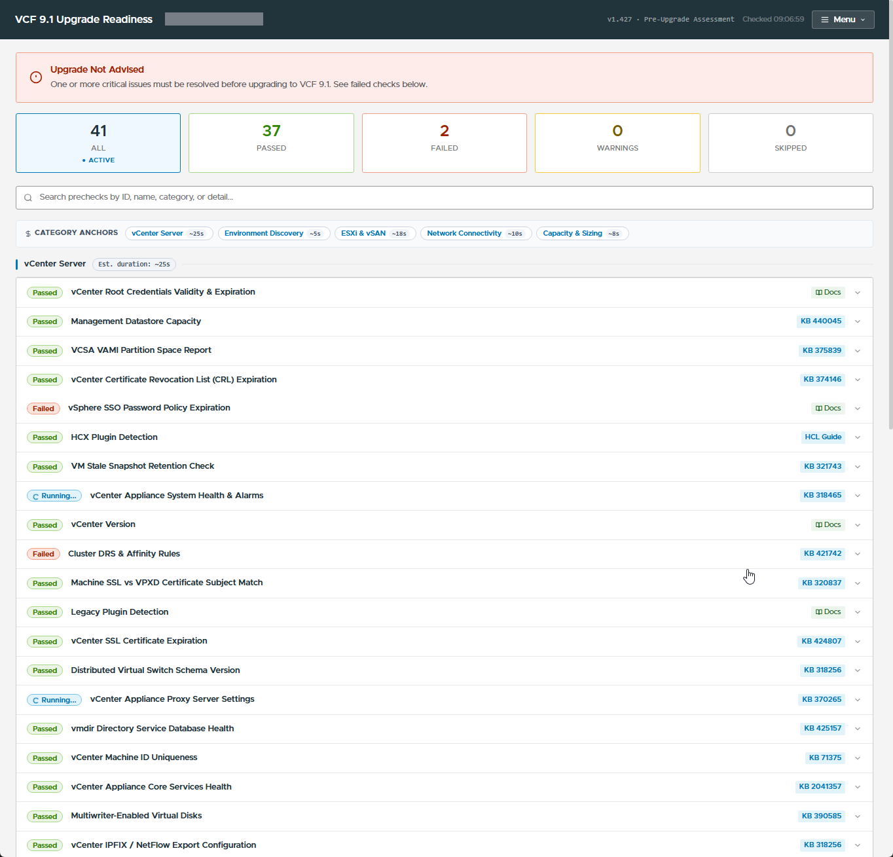

The reference column gives the KB number or link type exactly as the
tool shows it. Only KB 421742 was read for this doc.

**vCenter Server (~25s, 23 checks)**

| Check | Reference shown |
| --- | --- |
| vCenter Root Credentials Validity & Expiration | Docs |
| Management Datastore Capacity | KB 440045 |
| VCSA VAMI Partition Space Report | KB 375839 |
| vCenter Certificate Revocation List (CRL) Expiration | KB 374146 |
| vSphere SSO Password Policy Expiration | Docs |
| HCX Plugin Detection | HCL Guide |
| VM Stale Snapshot Retention Check | KB 321743 |
| vCenter Appliance System Health & Alarms | KB 318465 |
| vCenter Version | Docs |
| Cluster DRS & Affinity Rules | KB 421742 |
| Machine SSL vs VPXD Certificate Subject Match | KB 320837 |
| Legacy Plugin Detection | Docs |
| vCenter SSL Certificate Expiration | KB 424807 |
| Distributed Virtual Switch Schema Version | KB 318256 |
| vCenter Appliance Proxy Server Settings | KB 370265 |
| vmdir Directory Service Database Health | KB 425157 |
| vCenter Machine ID Uniqueness | KB 71375 |
| vCenter Appliance Core Services Health | KB 2041357 |
| Multiwriter-Enabled Virtual Disks | KB 390585 |
| vCenter IPFIX / NetFlow Export Configuration | KB 318256 |
| vCenter Enhanced Linked Mode (ELM) & Topology Health | KB 442859 |
| vmdir SSO Directory Local Domain State | KB 367525 |
| VCSA Inode & Heap Dump (.hprof) Audit | KB 375839 |

**Environment Discovery (~5s, 2 checks, both reported as Info)**

| Check | Reference shown |
| --- | --- |
| DNS FQDN Requirement | Docs |
| vSphere Supervisor Cluster Detection | Docs |

**ESXi & vSAN (~18s, 11 checks)**

| Check | Reference shown |
| --- | --- |
| ESXi Host Versions | Docs |
| ESXi Host Lockdown Mode Status | KB 336894 |
| ESXi execInstalledOnly Enforcement | Docs |
| vSAN Cluster Overall Health | KB 318492 |
| vSAN Disk & Disk Group State | KB 327034 |
| vSAN Witness Host Version | KB 318512 |
| vSAN Inaccessible Objects Check | KB 318501 |
| vCenter ESXi Host Connection Status | Docs |
| ESXi Host Memory Utilization Audit | KB 318465 |
| ESXi Host Hardware Compatibility (HCL) | HCL Guide |
| ESXi Image Profile Baseline Verification | Docs |

**Network Connectivity (~10s, 2 checks)**

| Check | Reference shown |
| --- | --- |
| Network Port HTTPS (443) | Docs |
| Network Port SSH (22) | Docs |

**Capacity & Sizing (~8s, 1 check)**

| Check | Reference shown |
| --- | --- |
| VCF 9.1 Sizing & Resource Delta Estimator | Docs |

- **Every check here is a vCenter, ESXi or vSAN check.** None of them
  needs SDDC Manager to make sense, which is a good sign for a
  standalone VVF or plain vSphere vCenter. It is still untested there.
  The vCenter Appliance Proxy Server Settings check overlaps with
  [vCenter proxy configuration](16-vcenter-proxy-configuration.md).
- **The numbers on the page do not add up.** The **All** tile says 41,
  the list has 39 rows, and the four status tiles (37 + 2 + 0 + 0) add
  up to 39. The two missing checks turn up in a Data Capture of the
  same run (see [Support Bundle and the
  Menu](#support-bundle-and-the-menu-v1427)): **Storage DRS on
  Management Datastores** and **vCenter Password Special Characters**
  are in the capture's precheck list but have no row on the page. The
  first of those came back as a warning, which the page never shows.
- **The Passed tile counts more than passes.** Three rows still showed
  *Running...* and two showed *Info* while the tile read 37 passed; only
  32 rows carried a *Passed* badge. So the tile counts running and Info
  rows as passed. The same three checks showed *Running...* in a third
  run nine minutes later: vCenter Appliance System Health & Alarms,
  vCenter Appliance Proxy Server Settings, and vmdir SSO Directory
  Local Domain State. They appear never to finish against this vCenter,
  and the tool reports them as passed anyway. Scroll the list for
  anything still running and check those items by hand.
- **Five categories here, against the landing card's "9 categories".**
  The SDDC Manager path below has thirteen.

---

## Field-observed: Upgrade Readiness run against SDDC Manager (lab environment)

**Field-observed (v1.427, lab environment):** the same check with the
**VCF 9.0.x** target, pointed at the SDDC Manager of a VCF 9.0.2
instance. This is the path the tool was built for, and it is about
twice the size of the vCenter path. The footer reads *"Checks validated
against known VCF 9.1 upgrade requirements · 9.0 → 9.1 upgrade path"*.


- **This run: 82 checks, 75 passed, 3 failed, 3 warnings, 0 skipped**,
  in **13 categories**. The landing card's *"20+ pre-flight checks
  across 9 categories"* undersells it. Verdict: *"Upgrade Not
  Advised"*.
- **Failed:** the same two as on the vCenter path (Cluster DRS &
  Affinity Rules, vSphere SSO Password Policy Expiration), plus **DNS
  FQDN Requirement**, which the vCenter path reported as Info. The
  detail was not captured.
- **Warnings:** VCF Services Runtime Node IP Planning, Network Port
  Bootstrap Service (5480), and Depot Reachability. The detail was not
  captured.
- **The counts are off here too, and by more.** The tile says 82, the
  list has 75 rows, and the status tiles add up to 81. At the moment of
  capture, 16 of the 18 vCenter Server checks still showed
  *Running...*, with the tiles already reading 75 passed. Same advice
  as above: scroll the list and wait for it to settle before reading
  the result.
- **Switching target in the same session leaves stale checks behind.**
  A vCenter run started a few minutes after this SDDC Manager run kept
  the 82-check set. The page then showed **37 passed, 35 failed, 8
  skipped** for the vCenter: every SDDC Manager check was marked
  Failed and the VxRail check Skipped, because there was no SDDC
  Manager connection to run them against. The earlier vCenter runs in
  a fresh session showed 41 checks and 2 failed. After an SDDC Manager
  run, disconnect or restart the tool before checking a vCenter, or
  the verdict is meaningless.

### What the SDDC Manager path checks

Compared to the vCenter path, ESXi Host Versions and vCenter Version
move to a Version Compatibility category, and ESXi & vSAN gains two
checks. The vCenter Server category listed 18 checks
here against 23 on the vCenter path: Management Datastore Capacity,
vCenter SSL Certificate Expiration, vCenter Appliance Proxy Server
Settings, and VCSA Inode & Heap Dump Audit were not in the list. The
categories that exist only on this path, with the reference exactly as
the tool shows it (none of these KBs was read for this doc):

**SDDC Manager (~12s, 14 checks)**

| Check | Reference shown |
| --- | --- |
| VCF Bill of Materials Upgrade Readiness Check | Interop Matrix |
| SDDC Manager Failed Tasks | KB 435569 |
| VCF License Key Expiration & Allocation | KB 145804 |
| SDDC Manager Subservice Health | Docs |
| SDDC Manager Backup User Account Status | KB 399414 |
| Async Patch Application Audit | KB 322476 |
| Hotfix Version Alias Coverage | KB 314649 |
| SDDC Manager Platform Lock Table | KB 439473 |
| SDDC Manager Storage Capacity Check | KB 313650 |
| SDDC Manager Release Manifest Polling | KB 424596 |
| VxRail Manager Integration Table Audit | KB 318350 |
| vLCM / VUM Image Management Mode Transition | KB 385617 |
| SDDC Manager Pre-check Service API Responsiveness | Docs |
| Management Domain Cluster Headroom | Docs |

**NSX-T Networking (~15s, 10 checks)**

| Check | Reference shown |
| --- | --- |
| NSX Cluster Backup Schedule Verification | Docs |
| NSX Manager Active Critical Alarms | Docs |
| NSX Application Platform (NAPP) Intelligence | Docs |
| NSX Transport Node Latency Profile | KB 376769 |
| NSX Global Manager Federation Status | Docs |
| NSX Manager API Rate Throttling Status | KB 379700 |
| NSX Manager Admin / Root Password Expiration | Docs |
| NSX Compute Manager State | KB 399868 |
| NSX Manager Cluster Disk Utilization | KB 317683 |
| NSX Node Installation & Staging State | Docs |

**Network (~10s, 3 checks)**

| Check | Reference shown |
| --- | --- |
| VCF Services Runtime Node IP Planning | KB 440223 |
| DNS FQDN Case Sensitivity | Docs |
| VCF Internal CIDR Conflict | Docs |

**Network Connectivity (~10s, 4 checks)**

| Check | Reference shown |
| --- | --- |
| Network Port Bootstrap Service (5480) | KB 440449, Docs |
| Network Port HTTPS (443) | Docs |
| Network Port SSH (22) | Docs |
| Port 5480 Proxy Bypass Check | KB 433584 |

**Software Depot (~8s, 3 checks)**

| Check | Reference shown |
| --- | --- |
| Depot Reachability | Docs |
| SDDC Manager Depot Account Status | KB 390098 |
| Online Depot Connection | Docs |

**Version Compatibility (~5s, 5 checks)**

| Check | Reference shown |
| --- | --- |
| ESXi Host Versions | Docs |
| VCF Source Version | Docs |
| NSX Version | Docs |
| RDU Planned Downtime Window Availability | KB 399001 |
| vCenter Version | Docs |

**Single-check categories**

| Category | Check | Reference shown |
| --- | --- | --- |
| Configuration (~8s) | NTP Server Reachability | Docs |
| Proxy & Trust (~6s) | Trusted Certificates | KB 424807 |
| Capacity & Sizing (~8s) | VCF 9.1 Sizing & Resource Delta Estimator | Docs |
| Licensing & Capacity (~8s) | Host CPU Cores & vSAN TiB Entitlement Audit | Docs |

**Added to ESXi & vSAN on this path:** VCP CIM Firewall Ruleset
Compliance (KB 400120) and vSAN On-Disk Format Schema Version
(KB 327034).

**Where these checks meet the rest of this guide:**

- **vLCM / VUM Image Management Mode Transition** is the check behind
  [VUM to vLCM migration](15-vum-to-vlcm-migration.md).
- **VxRail Manager Integration Table Audit** matters only on VxRail;
  see the [VxRail addendum](vxrail-addendum.md).
- **VCF Services Runtime Node IP Planning** checks ahead of time for
  the node IP pool that the [Services tab](#services-tab) shows once
  9.1 is running (12–30 IPs).
- **DNS FQDN Case Sensitivity** is the same class of problem as the
  all-lowercase FQDN requirement in [Patching an existing VCF 9.1
  fleet](20-patching-an-existing-vcf9-fleet.md#backup-before-patching-and-what-rollback-actually-means).
- **The prerequisites tables in [Full VCF upgrade
  sequence](13-vcf-upgrade-sequence.md)** remain the reference. Use
  this list to see what the tool does and does not cover, not as a
  replacement.

---

## Field-observed: Management Services Inspector walkthrough (lab environment)

Once connected, the header's **Use Cases** link becomes a **Menu**
dropdown, and four tabs appear alongside always-present **Support
Bundle** and **Data Capture** buttons (v1.300; see [Support Bundle and
the Menu](#support-bundle-and-the-menu-v1427) for v1.427): **Services**,
**Runtime Health**, **Advanced Troubleshooting**, and **Actions**. The
Services and Advanced
Troubleshooting tabs below were captured on v1.300; the Runtime Health
and Actions tabs were captured on v1.427.

**A recurring UI pattern across all three tabs: multiple status chips
appear side by side rather than one resolved verdict** – e.g. Backup
shows `Checking...` / `OK` / `Not Configured` together, Database Cluster
Health shows `3 clusters healthy` *and* `No clusters found` together,
Workflows shows `Checking...` / `2 running` / `All clear` together. Read
the detail panel or the underlying number, not just the badge set, before
concluding a section is fine or broken.

### Services tab

**Field-observed (v1.427, lab environment): this tab is much shorter
than in v1.300.** It now holds three things: the top-line counts, a
collapsed **Platform IP Pool** row (status badge plus total / in use /
free, here 19 / 4 / 15), and the **Deployed Services** cards under one
*All Management Services* group with a filter box. The backup, NTP,
volumes, tasks, node placement, database and package panels listed
below moved to the [Runtime Health tab](#runtime-health-tab), and so
did the Control Plane Nodes block, which is now part of Node Topology
there. The Virtual IPs and Node IP Assignments tables are now inside
the Platform IP Pool row, which is collapsed by default.

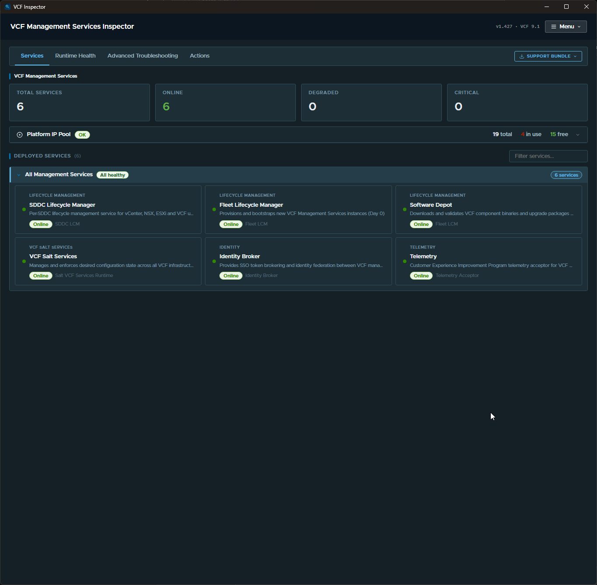

This capture shows **6 services**, not 8: the Realtime Metrics and Log
Management cards are absent. Both are optional components, so the count
most likely reflects what was deployed in the lab at the time, not a
change in the tool. The Software Depot card now shows `Fleet LCM` as
its short name.

**The Platform IP Pool row, expanded, holds everything the v1.300 tab
showed about addressing:**


- An allocation bar and four tiles: total pool capacity, currently
  assigned, orphaned leases, free available.
- The sizing callout and the **How to expand the IP pool in VCF
  Operations** steps, unchanged from the description below.
- **IP Pool:** the pool's name, health badge, and range.
- **Virtual IPs** and **Node IP Assignments**, as described below. With
  Log Management not deployed, the Virtual IPs table has five rows and
  no Log Management FQDN.

Two details in the numbers. The *4 IPs currently assigned* are the
three nodes plus the Control Plane VIP, which comes out of the same
pool. And the callout says 15 free IPs support *"up to 8 additional
scale-out node(s)"* at 2 IPs per node, where 15 divided by 2 gives 7.
Do the division yourself before planning a scale-out on that figure.

The rest of this section is the v1.300 walkthrough. The content still
applies; the location of each panel may not.

- **Top-line summary:** Total Services / Online / Degraded / Critical
  counts (observed: 8 / 8 / 0 / 0).
- **Platform IP Pool:** allocation bar (total/assigned/orphaned/free),
  a sizing callout confirming the pool meets VCF Services Runtime's
  **12–30 IP** requirement and how many more scale-out nodes the free
  balance supports (2 IPs per node for Node IP + Pod CIDR), and an
  expandable **exact navigation path to expand it** – this corroborates
  and extends the UI path documented in [Patching an existing VCF 9.1
  fleet, Step 3](20-patching-an-existing-vcf9-fleet.md#step-3-the-ui-walkthrough-per-component):
  log into VCF Operations as **Administrator**, **Build → Lifecycle →
  VCF Management**, select **VCF Services Runtime**, actions menu →
  **Expand Node IP Pool**.
- **Virtual IPs table:** Control Plane VIP, VCF Services Runtime FQDN,
  Fleet Components FQDN, Instance Components FQDN, VIDB FQDN, and Log
  Management FQDN, each with its own IP – confirms these are distinct
  addressable endpoints, not aliases of one shared VIP.
- **Node IP Assignments table:** every node's name, role (Control
  Plane / Worker Node), and IP.
- **Deployed Services (8 cards observed):** grouped by category –
  **Lifecycle Management** (SDDC Lifecycle Manager, Fleet Lifecycle
  Manager, Software Depot), **VCF Salt Services**, **Identity**
  (Identity Broker), **Telemetry**, **Realtime Metrics**, **Logging**
  (Log Management) – each card shows an internal short name (`SDDC LCM`,
  `Fleet LCM`, `vidb-external`, `Telemetry Acceptor`, `Ops for Logs
  (mops)`, etc.), a one-line description, and an Online/Degraded/Critical
  badge. **VCF Automation and the Migration Service Engine did not
  appear** in this lab's 8-service list – consistent with VCF Automation
  running its own separate deployment rather than being one of the 8
  fleet-wide VCF Services Runtime services (though a field-verified fact
  from the sister repo's [Remove Components → VCF Automation](https://vcf-planning.hollebollevsan.nl/docs/16-remove-components/#vcf-automation) confirms Automation's *lifecycle operations* do
  authenticate against this same fleet-wide runtime, not a separate
  Automation-specific one). This is also the highest-risk, most complex
  pair in [docs/20's patching
  order](20-patching-an-existing-vcf9-fleet.md#step-2-respect-the-mandatory-dependency-order),
  which moves both to the end for that reason. **Open question, untested
  ([issue #27](https://github.com/pauldiee/VCFUpgradeGuide/issues/27)):**
  whether pointing this same connect form at a VCF Automation
  control-plane node (rather than the VCF Services Runtime one) would
  also work – the form only asks for a generic control-plane IP and SSH
  credentials, but the Services tab and Log Analyzer only surfaced the 8
  fleet-wide services here, so it's unconfirmed whether Automation's own
  components would even be recognized.
- **Control Plane Nodes:** per-node CPU/memory gauges and a **System
  Services** list flagging any service in a bad state – field-observed
  5 flagged services on one node: `kube-controller-manager`,
  `kube-scheduler`, `kube-vip-<node>`, `vsphere-cpi`,
  `vsphere-csi-controller` (all tagged `sys`).
- **VCF Management Services Backup – directly relevant to patching.**
  Fields: SFTP Storage Target, Last Backup Timestamp, Status. Field
  observed **"No backup found"** with an explicit warning: *"Automated
  backups for VCF Management Services are either not configured or the
  last backup attempt failed or is older than 24 hours. Ensure SFTP
  automated backups are configured prior to executing updates or
  configuration changes."* This is the same automatic pre-patch backup
  mechanism documented in [Patching an existing VCF 9.1 fleet, Backup
  before patching](20-patching-an-existing-vcf9-fleet.md#backup-before-patching-and-what-rollback-actually-means)
  – checking this panel before opening a patch window is a faster
  confirmation than digging through **Build → Lifecycle → VCF Management
  → Backup & Restore** by hand.
- **NTP Synchronisation:** per-node offset table. **Field-observed
  anomaly:** every node showed an offset of **~0.0ms** yet was still
  badged **"Not Synced"** – don't treat the badge alone as a live drift
  alarm; check the offset value first.
- **Other panels observed, collapsed by default:** Volumes/Disks (PVC
  bound count), VCF Services Runtime Tasks (active task count), Node
  Placement (spread/zone status), Database Cluster Health, Platform
  Package Status (packages ready count), Platform Engine & Core
  Stability (probe count).

### Runtime Health tab

**Field-observed (v1.427, lab environment).** One overall verdict at the
top – **Runtime Health Check** with a status badge, a score out of 100
and the time of the last run – followed by a list of collapsible check
panels, most with their own **Refresh** button.


- **The score does not count everything the tab flags.** This lab
  scored **Healthy, 100/100** while the **Unhealthy & Degraded Checks
  Summary** directly below it reported *"1 issue identified"*: the
  Automated System Backup Advisory, `Not configured`, category *Backup &
  Disaster Recovery*. A missing backup is listed as an issue but takes
  nothing off the score. Read the summary block, not just the number,
  before calling a fleet ready for a patch window.
- **Unhealthy & Degraded Checks Summary** – lists every check the last
  audit found unhealthy or degraded, each with a shortcut to its panel
  (here: **Inspect Backup Status**). The block also shows a *"Telemetry
  Recorded"* marker. The screen does not say what is recorded or where
  it goes – worth knowing about next to the landing page's *"All
  communication is local to your machine"* claim.
- **Check panels observed**, with this lab's badges:

  | Panel | Badge here |
  | --- | --- |
  | Service Health Probes (has a **Run** button) | All healthy |
  | Node Topology | 3 nodes, all healthy |
  | Volumes / Disks | 21 PVCs bound |
  | VCF Management Services Backup | Not configured |
  | NTP Synchronisation | Synced |
  | VCF Services Runtime Tasks | No active tasks |
  | Node Placement | 1 nodes – zone info unavailable |
  | Database Cluster Health | 3 clusters healthy |
  | Platform Package Status | 8 packages ready |
  | Platform Engine & Core Stability | Healthy, 5 probes |

  A separate banner between the panels confirms *"All nodes are Ready,
  no unhealthy pods, and no high-restart pods detected."*
- **Node Topology, expanded, is a service-by-node placement map.** Under
  *Worker Nodes – VCF Management Services*, each worker node is a column
  headed by its name, IP, and CPU and memory gauges (percent plus
  millicores or Gi). Each row is a service with its pod count, and the
  cells name the pods running on that node. Observed in this lab, across
  two worker nodes:

  | Service | Pods | Pod names shown |
  | --- | --- | --- |
  | Fleet LCM | 4 | `vcf-fleet-build-service-...`, `vcf-fleet-lcm-db` (one per node), `vcf-fleet-upgrade-service-...` |
  | Identity Broker | 2 | `vidb-postgres-instance`, `vidb-service` |
  | Salt Master / Minion | 2 | `salt-master`, `salt-minion` |
  | Salt RaaS | 3 | `raas`, `pgdatabase`, `redis` |
  | SDDC LCM | 4 | `vcf-sddc-build-service-...`, `vcf-sddc-lcm-db` (one per node), `vcf-sddc-upgrade-service-...` |
  | Software Depot | 2 | `depot-service`, `distribution-service` |
  | Telemetry | 1 | `telemetry-acceptor` |

  A last row, *System Services*, gives a healthy system pod count per
  node (47 and 49 here). Below the map, **Control Plane Nodes** lists
  each control plane node with the same gauges and its own system pod
  count (one node, 22 pods). This is where to look when a worker node is
  under pressure: it shows at a glance which services lose pods if that
  node goes away. In this lab both Salt Master / Minion pods sat on one
  node.

  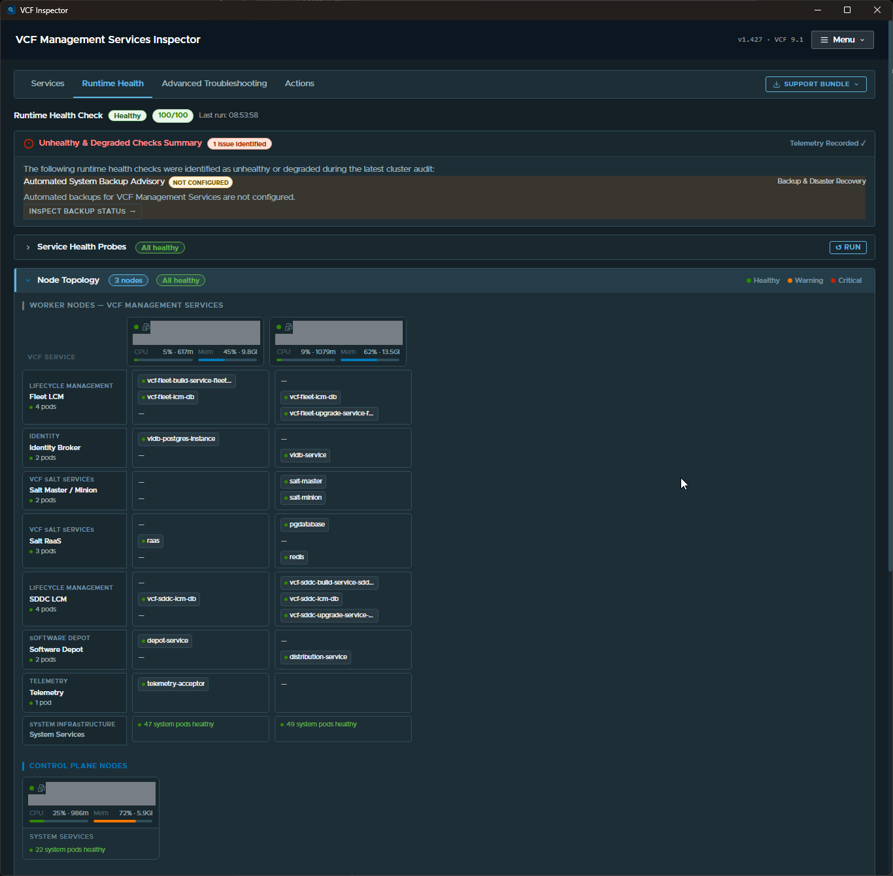
- **Most of these panels are described under the Services tab above**
  (backup, NTP, volumes, tasks, node placement, database clusters,
  packages, platform engine), because that is where the v1.300
  walkthrough recorded them. In v1.427 they sit on Runtime Health and
  the Services tab no longer shows them.
- **The conflicting chips from v1.300 are still there; dark mode hides
  them.** The dark-mode capture above shows one badge per panel. The
  same tab in light mode shows Backup with *Checking...*, *OK* and *Not
  Configured* side by side, Database Cluster Health with *3 clusters
  healthy* next to *No clusters found*, and Node Placement with *Spread
  correctly* next to *1 nodes – zone info unavailable*. Use light mode
  on this tab, and read the panel detail, not the chips.

  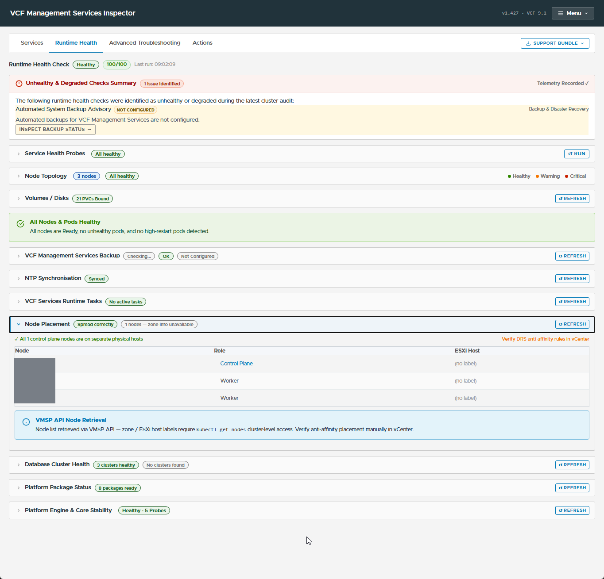
- **NTP reads Synced** where v1.300 badged every node *Not Synced* at a
  ~0.0ms offset.
- **Node Placement cannot see host placement, and says so only when
  expanded.** The chip reads *Spread correctly* and the panel states
  *"All 1 control-plane nodes are on separate physical hosts"*, but the
  ESXi Host column shows *(no label)* for every node. The note below
  the table explains why: the node list comes from the VMSP API, and
  zone and ESXi host labels need `kubectl get nodes` cluster-level
  access. The panel's own advice is *"Verify DRS anti-affinity rules in
  vCenter"*. So *Spread correctly* here means nothing was checked: it
  counts control plane nodes only (hence *1 nodes* against 3 in Node
  Topology), and one node is always on a separate host. Check placement
  in vCenter.
- **The backup panel is unchanged in substance** – SFTP Storage Target,
  Last Backup Timestamp, Status (*"No backup found"*), and the same
  warning text quoted under the Services tab. The same finding now shows
  up in three places: this panel, the summary at the top of this tab,
  and the Actions tab's banner.

### Advanced Troubleshooting tab

Framed in its own intro callout as *"deeper diagnostic tools... most
useful when working with VMware Support to identify root causes or
accelerate case resolution"* – i.e. escalation-tier detail, not the
first place to look.

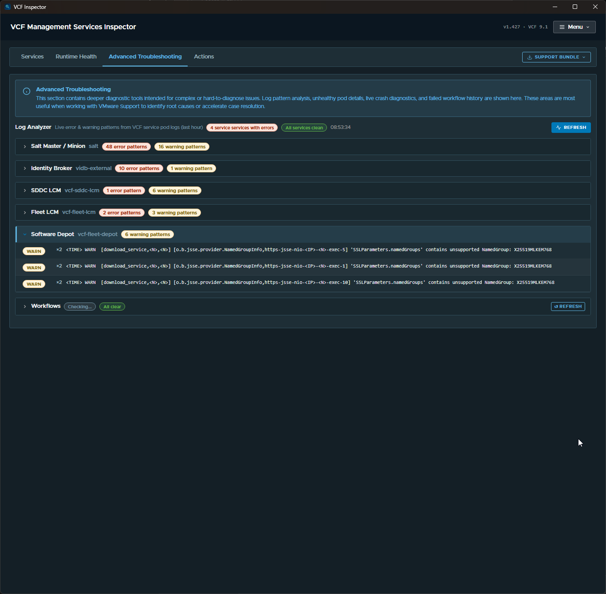

- **Log Analyzer** – *"Live error & warning patterns from VCF service
  pod logs (last hour)"*, refreshable, broken down per service with its
  internal short name and separate error/warning pattern counts.
  Field-observed counts on v1.300 (a snapshot, not necessarily
  representative): Salt Master/Minion 48 errors / 16 warnings, SDDC LCM
  28/7, Fleet LCM 27/7, Identity Broker 14/1, Log Management 4/15, Salt
  RaaS 0/21, Software Depot 0/6. High counts here don't necessarily mean
  the service is unhealthy on their own – cross-check against the
  Services tab's Online/Degraded/Critical badge for that same service
  before treating a pattern count as an active problem.
- **Unhealthy Pods** – a count with drill-down (field-observed on
  v1.300: 5 pods).
- **Workflows** – failed/running Fleet and SDDC lifecycle workflow
  history, refreshable.

**Field-observed (v1.427, lab environment):**

- **Same layout, same caveat.** Counts in the screenshot: Salt
  Master/Minion (`salt`) 48 errors / 16 warnings, Identity Broker
  (`vidb-external`) 10/1, SDDC LCM (`vcf-sddc-lcm`) 1/6, Fleet LCM
  (`vcf-fleet-lcm`) 2/3, Software Depot (`vcf-fleet-depot`) 0/6. Every
  one of these services was **Online** on the Services tab and the
  runtime scored 100/100 at the same time, so error patterns in the
  last hour of logs are normal on a healthy fleet. Salt shows the same
  48/16 in both captures.
- **The header contradicts itself.** Two chips sit side by side: *"4
  service services with errors"* and *"All services clean"*. Workflows
  does the same with *Checking...* next to *All clear*. The stacked-chip
  pattern from v1.300 is still present on this tab.
- **An expanded row shows normalised patterns, not raw log lines.** Each
  entry has a severity tag, an occurrence count (`×2`), and the log line
  with variable parts replaced by placeholders such as `<TIME>`, `<N>`
  and `<IP>`. The Software Depot warnings here were all one message
  across three threads: `'SSLParameters.namedGroups' contains
  unsupported NamedGroup: X25519MLKEM768`. That is a TLS key-exchange
  group the depot's TLS provider does not support. The depot was
  healthy and authenticated at the time, so treat this one as noise.
- **No Unhealthy Pods panel** appeared in this capture, with no
  unhealthy pods in the lab. It seems to show only when there is
  something to list. The intro callout now also mentions *"live crash
  diagnostics"*, which was not visible here either.

### Actions tab

**This tab executes real remediation against the live environment, not
just diagnostics** – closer to lsdoctor's repair modes than to VDT's
read-only sweep, and gated behind an explicit consent toggle: *"I
acknowledge the operational impact and confirm authorization to execute
administrative actions."* Per its own warning banner: *"The remediation
tools and interactive console on this page execute cluster-wide
commands, restart daemon processes, compact database stores, or modify
platform settings. You must acknowledge authorization before actions can
be executed."*

**Field-observed (v1.427, lab environment): ten actions, up from six in
v1.300.** The cards below were read from the UI only – none of the four
new actions has been run here.

**The banner now carries a Backup Advisory** above the consent toggle.
With no backup configured it reads *"Backups Not Configured"* and
*"It is strongly recommended to configure and run automated SFTP backups
before executing administrative actions"*, with SFTP Target Host, Last
Backup Timestamp and Last Backup Status fields. It is the same check as
the Runtime Health tab's backup panel, repeated where it matters: in
front of the buttons that change things. The consent toggle still works without
a backup, so the advisory is a warning, not a gate.

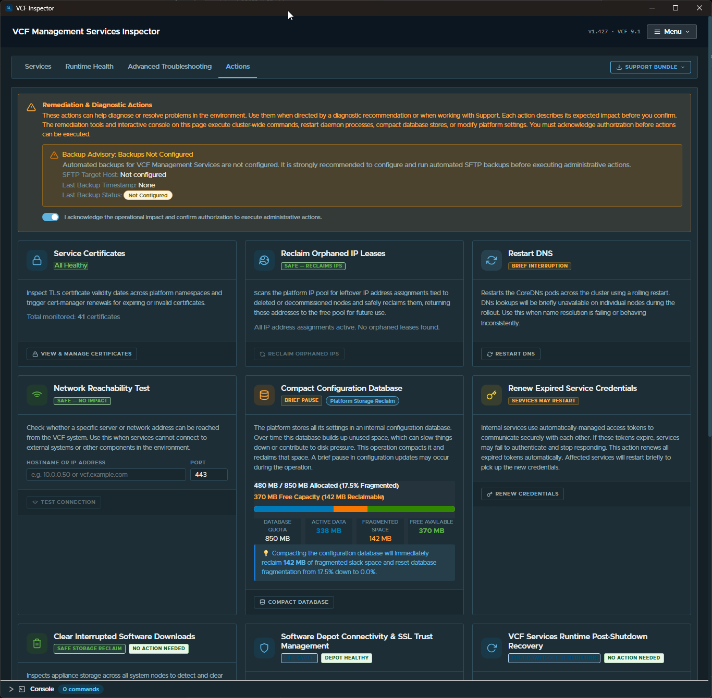

**The six actions carried over from v1.300:**

| Action | Impact badge | What it does |
| --- | --- | --- |
| Service Certificates | All healthy | Inspects TLS cert validity across platform namespaces and can trigger cert-manager renewals for expiring/invalid certs (41 certificates monitored in this lab on v1.427, 48 on v1.300) |
| Reclaim Orphaned IP Leases | Safe – reclaims IPs | Scans the platform IP pool for leases tied to deleted/decommissioned nodes and reclaims them |
| Restart DNS | Brief interruption | Rolling restart of CoreDNS pods cluster-wide; per-node DNS lookups briefly unavailable during rollout |
| Network Reachability Test | Safe – no impact | Tests whether a given hostname/IP:port is reachable from the VCF system |
| Compact Configuration Database | Brief pause (platform storage reclaim) | Compacts the internal config database and reclaims fragmented space; a brief pause in config updates may occur |
| Renew Expired Service Credentials | Services may restart | Renews expired inter-service auth tokens; affected services restart briefly to pick up new credentials |

The Compact Configuration Database panel also surfaces live capacity
numbers (quota, active data, fragmented space, free available, percent
fragmented) before you commit to running it – worth checking that number
before assuming it needs to run. v1.427 adds a line stating how much
space a compaction would reclaim.

**View & Manage Certificates** on the Service Certificates card opens a
**Service Certificate Status** dialog: one row per certificate with its
namespace, status, days until expiry, and a **Renew** button per row.

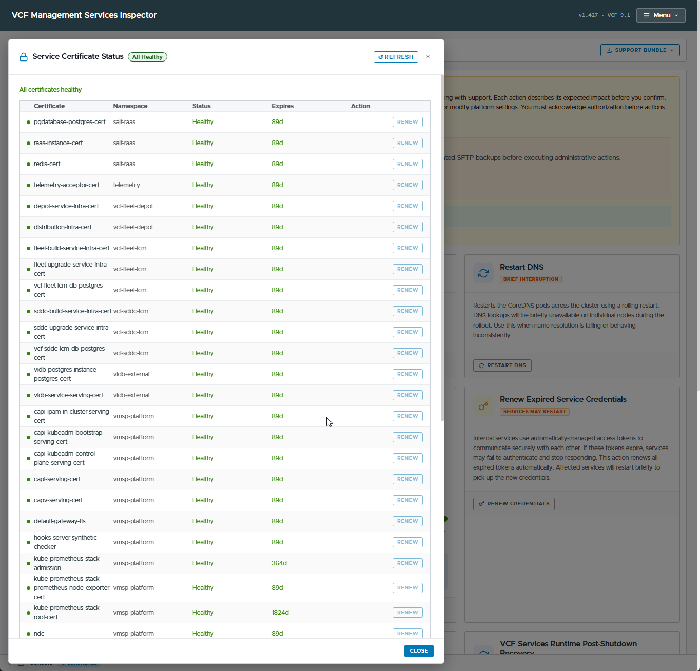

The 41 certificates in this lab, by namespace:

| Namespace | Certificates | Examples |
| --- | --- | --- |
| `salt-raas` | 3 | `pgdatabase-postgres-cert`, `raas-instance-cert`, `redis-cert` |
| `telemetry` | 1 | `telemetry-acceptor-cert` |
| `vcf-fleet-depot` | 2 | `depot-service-intra-cert`, `distribution-intra-cert` |
| `vcf-fleet-lcm` | 3 | `fleet-build-service-intra-cert`, `fleet-upgrade-service-intra-cert`, `vcf-fleet-lcm-db-postgres-cert` |
| `vcf-sddc-lcm` | 3 | `sddc-build-service-intra-cert`, `sddc-upgrade-service-intra-cert`, `vcf-sddc-lcm-db-postgres-cert` |
| `vidb-external` | 2 | `vidb-postgres-instance-postgres-cert`, `vidb-service-serving-cert` |
| `vmsp-platform` | 27 | `vmsp-etcd-cert`, `registry-cert`, `default-gateway-tls`, `vcf-cluster-ca`, `vcf-external-cluster-ca-cert` |

Nearly all of them showed **89 days** to expiry, which points to
short-lived internal certificates on a 90-day automatic renewal (the
card names cert-manager). The
exceptions are the CA-type certificates: `vcf-cluster-ca` and
`vcf-external-cluster-ca-cert` at 1155 days, `kube-prometheus-stack-root-cert`
at 1824 days, and `kube-prometheus-stack-admission` at 364 days. This
dialog is the place to look when a runtime has been powered off for
weeks and comes back with services that do not trust each other.

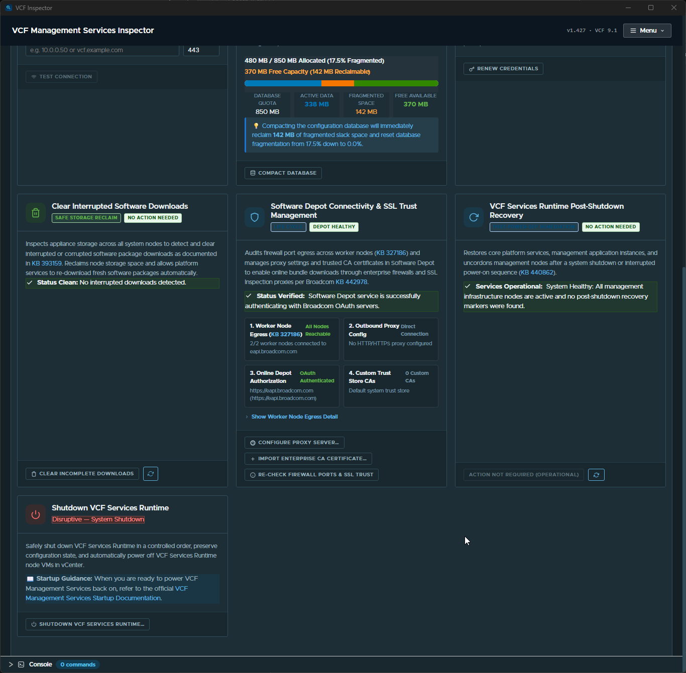

**The four actions new in v1.427.** Three of them name the Broadcom KB
they automate, and three show a live status line and keep their button
idle when there is nothing to fix:

| Action | Badges | What it does |
| --- | --- | --- |
| Clear Interrupted Software Downloads | Safe storage reclaim, plus a status badge (`No action needed` here) | Inspects appliance storage on all nodes for interrupted or corrupted software package downloads and clears them, so the platform re-downloads fresh packages ([KB 393159](https://knowledge.broadcom.com/external/article/393159)) |
| Software Depot Connectivity & SSL Trust Management | Life cycle, plus a status badge (`Depot healthy` here) | Audits outbound firewall access from the worker nodes ([KB 327186](https://knowledge.broadcom.com/external/article/327186)) and manages the Software Depot's proxy settings and trusted CA certificates ([KB 442978](https://knowledge.broadcom.com/external/article/442978)) |
| VCF Services Runtime Post-Shutdown Recovery | Post-power-off remediation, plus a status badge (`No action needed` here) | Restores core platform services and management application instances and uncordons the management nodes after a shutdown or an interrupted power-on ([KB 440862](https://knowledge.broadcom.com/external/article/440862)) |
| Shutdown VCF Services Runtime | Disruptive – system shutdown | Shuts VCF Services Runtime down in a controlled order, preserves configuration state, and powers off the runtime node VMs in vCenter |

**Dark mode hides two of these badges.** In the dark-mode capture above,
*Life cycle* and *Post-power-off remediation* render as unreadable
blocks. They are legible after **Menu → Switch to Light Mode**. If a
badge or status line looks blank in dark mode, check it in light mode
before assuming nothing is there.

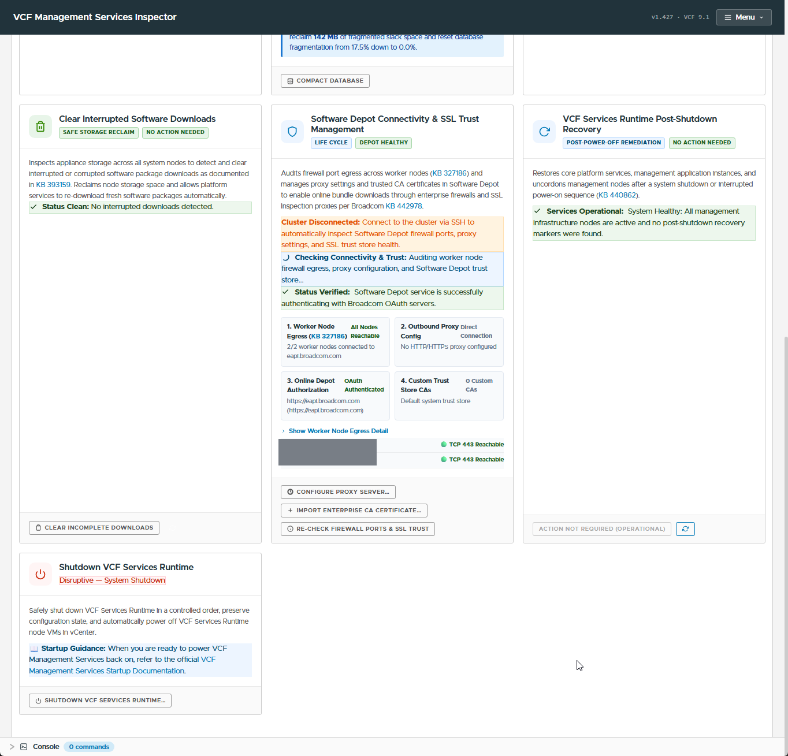

- **Clear Interrupted Software Downloads** – status line here: *"Status
  Clean: No interrupted downloads detected."* KB 393159 is titled
  *"Cleanup incomplete images from VMSP node 9.0"* and describes pods
  stuck in `PullBackOff`/`CrashLoopBackOff` after a failed image pull,
  fixed by hand with a script on the node. This card is the one-click
  version of that.
- **Software Depot Connectivity & SSL Trust Management** – the most
  useful of the four for patching, since a depot that cannot reach
  Broadcom stops everything in [Patching an existing VCF 9.1 fleet, Step
  1](20-patching-an-existing-vcf9-fleet.md#step-1-get-the-binaries-in-place)
  when the depot is online. It shows four checks side by side:
  1. **Worker Node Egress** – whether each worker node reaches
     `eapi.broadcom.com` (here: 2/2 nodes). **Show Worker Node Egress
     Detail** expands a per-node list with node name, IP and result
     (*"TCP 443 Reachable"*). KB 327186 is Broadcom's public URL list
     for VCF products.
  2. **Outbound Proxy Config** – the proxy in use, or *"Direct
     Connection"*.
  3. **Online Depot Authorization** – whether the Software Depot service
     authenticates against Broadcom's OAuth servers.
  4. **Custom Trust Store CAs** – the number of custom CAs added to the
     default system trust store.

  Three buttons: **Configure Proxy Server**, **Import Enterprise CA
  Certificate**, and **Re-check Firewall Ports & SSL Trust**. The CA
  import is the case KB 442978 covers: an SSL inspection proxy breaks
  the depot's TLS handshake, and the Software Depot wizard fails with
  *"Failed to connect to the authorization server"*. The KB's manual fix
  is a `vmsp-utility.py` script run as root on a control plane node,
  followed by about 15 minutes of service restarts. This is the depot's
  own proxy and trust store, separate from the vCenter appliance proxy
  in [vCenter proxy configuration](16-vcenter-proxy-configuration.md).

  The two dialogs, opened without submitting:

  - **Configure Proxy Server for VCF Management Services & Software
    Depot.** The scope is wider than the card suggests: *"cluster-wide
    HTTP, HTTPS, and NO_PROXY bypass settings across VCF Management
    Services, Software Depot, and SDDC Manager"*. Fields: an enable
    toggle, HTTP Proxy URL, HTTPS Proxy URL (with **Copy from HTTP
    Proxy**), NO_PROXY exceptions, and an optional proxy username and
    password. The NO_PROXY field comes prefilled with `localhost`,
    `127.0.0.1`, `.cluster.local`, `.svc`, the environment's own DNS
    suffix, and the three private ranges `10.0.0.0/8`, `172.16.0.0/12`
    and `192.168.0.0/16`. The dialog warns to keep local cluster ranges
    and internal domain suffixes in that list so cluster-internal
    traffic does not go through the proxy. Buttons: **Save & Apply
    Proxy Configuration**, **Remove Proxy Configuration**, **Cancel**.
    Check the prefilled list before saving: all three private ranges
    bypass the proxy, so every internal destination is reached
    directly. That is wrong where an internal target, such as an
    offline depot in another network zone, is only reachable through
    the proxy.
  - **Import Enterprise SSL Inspection CA Certificate.** One field for
    a PEM-encoded root or intermediate CA chain, which *"will be added
    to the Software Depot Java trust store per Broadcom KB 442978"*.
    The dialog states the wait itself: *"Software Depot background
    services require approximately 15 minutes to re-initialize after
    importing a new CA certificate."* Plan for the depot being
    unavailable that long.

  **The card's status lines can contradict each other.** A light-mode
  capture of the same connected session showed three at once: *"Cluster
  Disconnected: Connect to the cluster via SSH..."*, *"Checking
  Connectivity & Trust..."*, and *"Status Verified: Software Depot
  service is successfully authenticating with Broadcom OAuth servers."*
  The dark-mode capture showed only the last one. This is the same
  stacked-status pattern noted at the top of this walkthrough. Go by the
  four numbered checks, not the status lines.
- **VCF Services Runtime Post-Shutdown Recovery** – status line here:
  *"System Healthy: All management infrastructure nodes are active and
  no post-shutdown recovery markers were found"*, and the button is
  disabled (*"Action not required (operational)"*). KB 440862 covers a
  VCF Management Services or VCF Automation cluster on 9.1.0.x that
  does not come back on its own after a graceful shutdown: the VMs power
  on, but the Fleet Lifecycle UI stays unreachable after 20+ minutes and
  services sit at 0 replicas. The KB says to wait 15–20 minutes for
  automatic recovery before intervening, so give it that long before
  reaching for this button.
- **Shutdown VCF Services Runtime** – the only action badged
  *Disruptive*, and the first in this tool that takes the whole runtime
  down on purpose. The card covers shutdown only. For startup it points
  to the official VCF Management Services startup documentation, and
  the recovery card above is the fallback when startup stalls. Shutting
  the runtime down is one step in a fleet-wide order, not a standalone
  task – see the companion repo's [Shutdown and
  startup](https://vcf-planning.hollebollevsan.nl/docs/13-shutdown-startup/)
  runbook for where it sits. That runbook does this step with Broadcom's
  runtime shutdown script, dry run first. Whether this button runs the
  same script underneath is not confirmed.

**The Console panel** sits collapsed below the action cards (`0
commands` in this lab). Expanded, it is a `kubectl` console against the
runtime: the input line is prefixed with `$ kubectl`, with `get pods -n
vmsp-platform` as the example, and a **Run** button. Seven quick-access
buttons sit above it: **All Pods**, **Nodes**, **Warning Events**,
**Namespaces**, **Pod CPU/Mem**, **All Services**, and **API
Resources**. No command was run here.

**The console is read-only by design.** An **allowlist** link in the
footer opens a side panel with the rules:

| | |
| --- | --- |
| Allowed verbs | `get`, `describe`, `logs`, `top`, `auth`, `explain`, `api-resources`, `api-versions` |
| Always blocked | `delete`, `apply`, `patch`, `exec`, `port-forward`, `proxy` |
| Blocked characters | `\|` `;` `&` `` ` `` `$` `>` `<` `\` |

So the console cannot change the cluster and cannot chain or redirect
commands; the remediation on this tab happens only through the action
cards. Read-only is not the same as harmless, though: the panel shows
no restriction on what `get` may read, so treat console output like a
capture file. Whether it returns secrets was not tested.


**The banner's backup status contradicts itself in light mode.** The
same capture shows *"Checking backup status..."*, the *"Backups Not
Configured"* advisory, and a green *"Backup Status OK: Last backup
completed successfully on (SFTP Target: Configured)"* line, all at
once, in a lab with no backup configured. Dark mode showed only the
advisory. The advisory is the correct one here; do not take the green
line as proof that a backup exists.

### Support Bundle and the Menu (v1.427)

**Field-observed (v1.427, lab environment).** v1.300 had separate
Support Bundle and Data Capture buttons next to the tabs. v1.427 keeps
only Support Bundle there and moves Data Capture into the header's
**Menu**.

- **Support Bundle** is now a dropdown with an **Include Components**
  list: **VMSP Platform**, **Fleet LCM**, **SDDC LCM**, **Salt**, and
  **Telemetry**, each with its own toggle, **All** / **None** shortcuts,
  and a **Generate** button. Identity Broker has no entry of its own in
  this list.
- **Menu** entries, in order: **Back to Use Cases**, **Manage
  Connection**, **Data Capture**, **Load Capture File**, **Community
  Feedback**, **Switch to Light Mode** (or Dark), and **Disconnect**.
- **Manage Connection** opens a dialog with three blocks. *Active
  Session Connection* shows the target node, the SSH user and the use
  case target, with a **Disconnect Session** button. *Data Refresh &
  Sync* shows the last sync time, a **Refresh Now** button and an
  **Auto-refresh (15s)** option; without it the tabs show the state as
  of the last sync. *Saved Connections* lists each saved node with its
  user, a **Switch to this node** button and a delete button.

  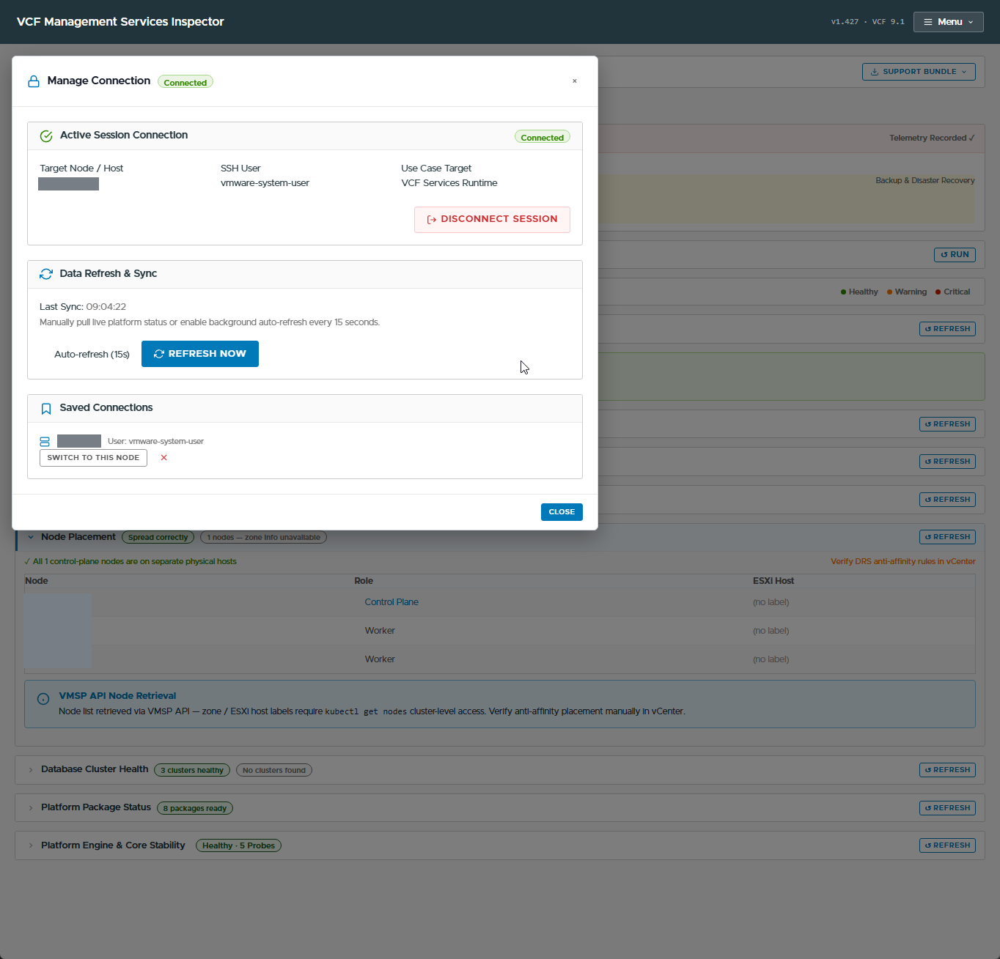
- **Data Capture** takes a **Diagnostic Capture Snapshot** of the
  connected runtime and opens it in a viewer, with **Download JSON** and
  **Copy JSON** buttons. The summary of this lab's capture: 3 cluster
  nodes, 148 pods scanned, 21 PVCs, 29 error and 14 warning log patterns
  over the last 2 hours, 1 Kubernetes warning event, 23 VMSP API
  endpoint responses, 2 host agent responses, and a readiness audit of
  41 prechecks. Tabs: **Issues & Remediation**, **Pre-checks**,
  **Pods**, **Events**, **PVCs**, **Nodes**, **Raw JSON**.

  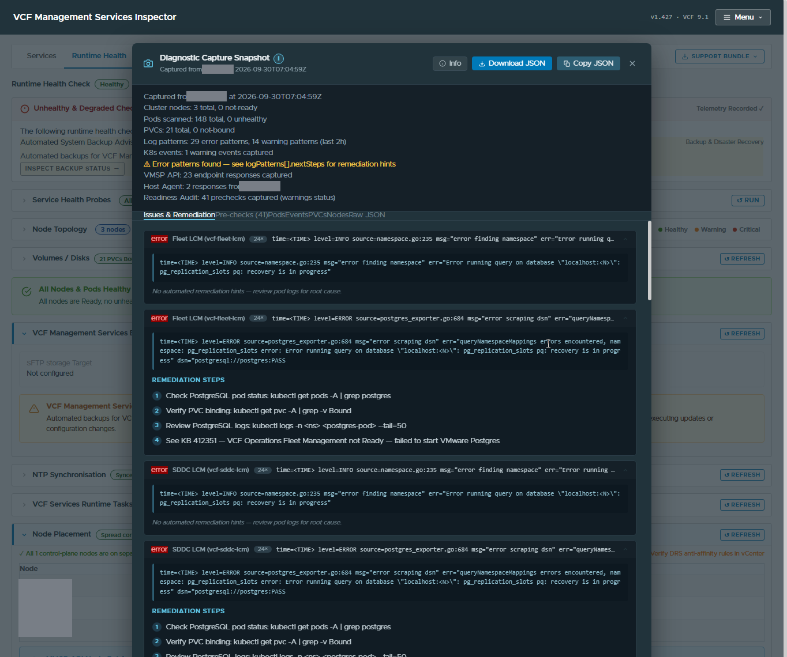

  The Issues & Remediation tab is the Log Analyzer's pattern list with
  one addition: **remediation steps** per pattern, where the tool has
  them. For a Fleet LCM and SDDC LCM Postgres error (`pg_replication_slots
  pq: recovery is in progress`) it listed three `kubectl` checks and a
  pointer to [KB 412351](https://knowledge.broadcom.com/external/article/412351).
  Other patterns read *"No automated remediation hints – review pod
  logs for root cause."* These errors were in the logs of a runtime that
  scored 100/100, so the same caveat applies as for the Log Analyzer: a
  pattern with remediation steps is not by itself a fault. KB 412351 is
  written for the Fleet Management appliance on 9.0.1, not for the 9.1
  runtime, so read it as background, not as a procedure.
- **Data Capture is built around the VCF Services Runtime, whichever
  use case is on screen.** Two runs from the Upgrade Readiness use case,
  after a readiness check against a vCenter:

  - *With the earlier Management Services session still connected:* the
    capture connected to the runtime control plane node and captured
    that, not the vCenter. Going **Back to Use Cases** does not drop
    the runtime connection.
  - *After Disconnect:* the capture is labelled as taken from the
    vCenter, and every cluster section is empty (0 nodes, 0 pods, 0
    PVCs, 0 log patterns, 0 events). It then shows a green *"No
    critical issues detected in the 2-hour log window"*. That tick
    means nothing was scanned, not that nothing is wrong. The same
    capture still lists 23 VMSP API endpoint responses and 2 host agent
    responses from the runtime control plane node's IP, after the
    disconnect. Whether those are live calls or data kept from the
    earlier session was not established.

  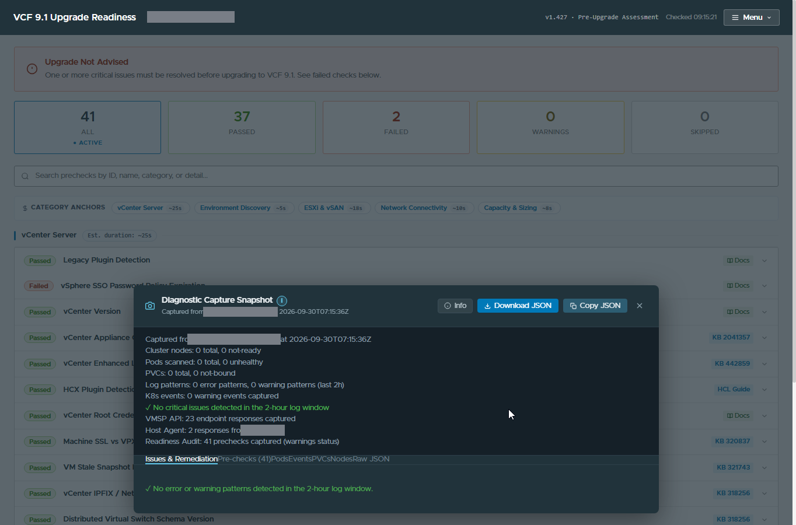

  In both cases the capture includes the readiness audit (*"41
  prechecks captured"*). For a vCenter-only readiness run, that
  Pre-checks tab is the useful part; ignore the cluster summary.
- **The Pre-checks tab is the readiness result as a table**, with
  Status, Category, Check Name and a one-line Detail per check. It is
  worth opening after every readiness run, for three reasons:

  - **It shows the detail without expanding each check.** For example,
    DNS FQDN Requirement reads *"All FQDNs registered in vCenter Server
    must be fully lowercase. Uppercase or mixed-case DNS entries are
    not supported in VCF 9.1 and will cause deployment or upgrade
    failures."* The port checks state that they probe from inside the
    vCenter VM.
  - **It holds checks the result page does not list.** On the vCenter
    path: Storage DRS on Management Datastores and vCenter Password
    Special Characters. The Storage DRS check returned a warning here
    (*"datastore cluster API not available (HTTP 400)"*), so the
    landing card's new Storage DRS check could not run against this
    vCenter.
  - **Its totals disagree with the page.** For the same vCenter the
    capture summarised *"Passed: 38 · Failed: 0 · Warnings: 1 ·
    Skipped: 0"* with status *Warnings*, where the page showed 37
    passed and 2 failed with *Upgrade Not Advised*. The two timed-out
    checks are not failures in the capture. When the two disagree,
    read the per-check detail in the capture.

  In dark mode the Check Name column is almost unreadable; switch to
  light mode for this tab.
- **Load Capture File** opens a file browser and asks for a capture
  JSON. A capture downloaded on one machine can be opened in the tool
  on another, without a connection to the fleet. Loading one was not
  tried here.
- **A capture JSON is environment data.** It holds node names, IPs, pod
  lists and log lines. Treat it like a support bundle: keep it out of
  tickets, chats and repositories that are not meant to hold it.

---

## Sources

- [VCF Inspector Fling (official VMware Cloud Foundation blog)](https://blogs.vmware.com/cloud-foundation/2026/07/28/vcf-inspector-fling/) – announcement, capabilities, download location, and usage
- [Should DRS Affinity Rules be disabled when upgrading ESXi hosts in a cluster (Broadcom KB 421742)](https://knowledge.broadcom.com/external/article/421742) – the guidance behind the Cluster DRS & Affinity Rules readiness check
- [VCF Operations Fleet Management is not Ready - failed to start VMware Postgres database server (Broadcom KB 412351)](https://knowledge.broadcom.com/external/article/412351) – the KB a Data Capture remediation hint points to; written for the 9.0.1 Fleet Management appliance
- [Cleanup incomplete images from VMSP node 9.0 (Broadcom KB 393159)](https://knowledge.broadcom.com/external/article/393159) – the manual procedure behind Clear Interrupted Software Downloads
- [Public URL list for VCF Products (Broadcom KB 327186)](https://knowledge.broadcom.com/external/article/327186) – the URLs the Worker Node Egress check is based on
- [Error: "Failed to connect to the authorization server" when using SSL inspection proxy in VCF Operations (Broadcom KB 442978)](https://knowledge.broadcom.com/external/article/442978) – the manual trust store fix behind Import Enterprise CA Certificate
- [VCF Management Services cluster or the VCF Automation cluster does not automatically recover after powering on VMs following a graceful shutdown (Broadcom KB 440862)](https://knowledge.broadcom.com/external/article/440862) – the manual procedure behind Post-Shutdown Recovery
